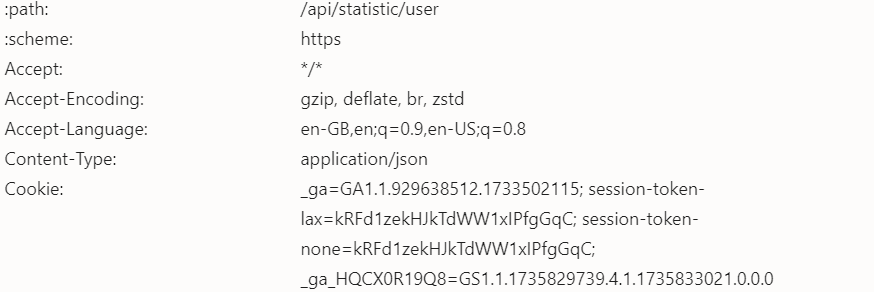

---

<h1 align="center">Бот Terminal Station</h1>

<p align="center">Автоматизируйте задачи в Terminal Station для повышения эффективности и результатов!</p>

---

## 🚀 **О Боте**

Этот бот разработан для автоматизации различных задач в Terminal Station, таких как:

- **Сбор урожая**
- **Выполнение квестов**
- **Игра в подбрасывание монеты**
- **Переключение аккаунтов**

С помощью этого бота вы можете сэкономить время и достичь оптимальных результатов без ручного вмешательства.

---

## 🌟 **Версия v1.0.1**

### **Изменения в версии v1.0.1**

- **Исправления ошибок**: Решены проблемы в **Игре Flipper**, что улучшило функциональность и стабильность.

---

## 📥 **Регистрация**

Зарегистрируйтесь и начните использовать Terminal Station по ссылке ниже:

<div align="center">
  <a href="https://t.me/terminalgame_bot/terminalgame?startapp=JF5KG8GP&startApp=JF5KG8GP" target="_blank">
    
  </a>
</div>

---

## ⚙️ **Настройка `config.json`**

| **Функция**            | **Описание**                                          | **По умолчанию** |
| ---------------------- | ----------------------------------------------------- | ----------------- |
| `harvest`              | Автоматический сбор наград                             | `true`            |
| `quest`                | Автоматическое выполнение квестов                     | `true`            |
| `game_coin_flip`       | Автоматическое участие в игре подбрасывания монеты    | `true`            |
| `delay_loop`           | Задержка перед повторением цикла (в миллисекундах)    | `3000`            |
| `delay_account_switch` | Задержка перед переключением аккаунтов (в секундах)   | `10`              |

---

## 📖 **Руководство по Установке**

1. **Клонируйте Репозиторий**  
   Клонируйте этот проект на свой локальный компьютер:

   ```bash
   git clone https://github.com/your-repository/terminal-station-bot.git
   ```

2. **Перейдите в Каталог Проекта**  
   Измените директорию терминала на папку проекта:

   ```bash
   cd terminal-station-bot
   ```

3. **Установите Зависимости**  
   Убедитесь, что все необходимые библиотеки установлены:

   ```bash
   pip install -r requirements.txt
   ```

4. **Настройте Query**  
   Введите ваш cookie Terminal Station в файл `query.txt`.

5. **Запустите Бота**  
   Выполните бота с помощью следующей команды:

   ```bash
   python main.py
   ```

---

## 🚀 **Основные Функции**

- **Авто Сбор Урожая**: Автоматически собирает награды.
- **Авто Выполнение Квестов**: Выполняет квесты без ручных усилий.
- **Авто Игра в Подбрасывание Монеты**: Участвует в игре подбрасывания монеты автоматически.
- **Авто Переключение Аккаунтов**: Переключается между аккаунтами автоматически.

---

## 🛠️ **Содействие**

Этот проект разработан **LIVEXORDS**. Если у вас есть предложения или вы хотите внести свой вклад, свяжитесь с нами по ссылке ниже:

<div align="center">
  <a href="https://t.me/livexordsscript" target="_blank">
    
  </a>
</div>

---

## 📄 **Примечания к `query.txt`**

Пожалуйста, введите ваш **cookie Terminal Station** в файл `query.txt`. 

> **Примечание**: Вам необходимо регулярно обновлять cookie, так как это токен, который может истечь.

---

## 📸 **Учебник по Настройке Cookie**

Следуйте этим шагам, чтобы получить ваш cookie для `query.txt`:

1. Щелкните правой кнопкой мыши на странице Terminal Station и выберите **Inspect** (Инспектировать).
2. Перейдите на вкладку **Network** (Сеть).
3. Найдите API с ссылкой `https://app.0xterminal.game/api/statistic/user`.
4. Прокрутите вниз и найдите переменную **cookie**, затем скопируйте её.
5. Вставьте cookie в файл `query.txt`.

<div align="center">
  
</div>

---
